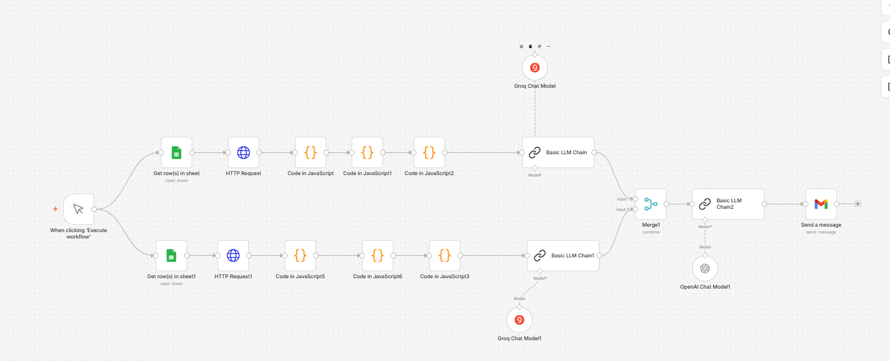

🚀 AI-Powered Indian Stock Market Intelligence System
📌 Overview

This project is an automated market intelligence system that analyzes the Indian stock market by combining stock-level (micro) and index-level (macro) data. It processes real-time data, generates structured insights using LLMs, and delivers a daily market report via email.

The system is built using n8n workflows, integrating APIs, custom data processing, and AI-based report generation.

🧠 Key Features
📊 Fetches real-time stock and index data via APIs
⚙️ Processes and computes metrics like returns, breadth, and performance
📈 Identifies top gainers, losers, and market trends
🧠 Uses LLMs to generate professional market reports
🔗 Combines macro (indices) and micro (stocks) analysis
📧 Automatically sends daily reports via emai

🏗️ Workflow Architecture

⚙️ Detailed Workflow
🟢 1. Stock Pipeline
Fetch stock tickers from Google Sheets
Call Yahoo Finance API
Process data (price, % change, volume, etc.)
Compute:
Market breadth
Top gainers & losers
Sector performance
Generate structured stock insights using LLM

🔵 2. Index Pipeline
Fetch index symbols from Google Sheets
Call Yahoo Finance API
Process index-level data
Compute:
Index breadth
Leading & lagging indices
Generate macro-level insights using LLM

🟣 3. Data Merge
Combine stock and index outputs using Merge Node
Ensure structured fields:
stock_*
index_*

4. Final AI Report Generation
Input: Combined structured data
Output: Human-readable market report including:
Market summary
Sector/index analysis
Market participation
Key insights
Outlook

5. Email Delivery
Automatically sends report using email node
Subject includes dynamic date
Clean formatted report body

📊 OVERALL MARKET SUMMARY
The market exhibited a positive bias with strength in banking and infrastructure indices...

📈 MARKET PARTICIPATION
Broad-based participation was observed with a majority of stocks advancing...

🚀 STOCK ACTION
Key gainers included UltraTech Cement and Bajaj Finance...

🔮 OUTLOOK
The current structure suggests continued strength with sectoral rotation...

🛠️ Tech Stack
Automation: n8n
Programming: JavaScript (Code Nodes), Python (optional extensions)
Data Sources: Yahoo Finance API
AI/LLM: OpenAI / Groq models
Database/Input: Google Sheets
Delivery: Email (SMTP/Gmail Node)

Concepts Used
Workflow Automation
API Integration
Data Transformation
Market Breadth Analysis
Agentic AI
LLM-based Report Generation
System Design (Macro + Micro Analysis)

